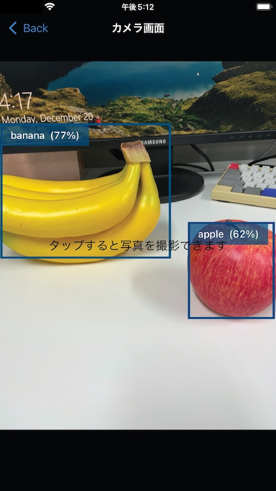
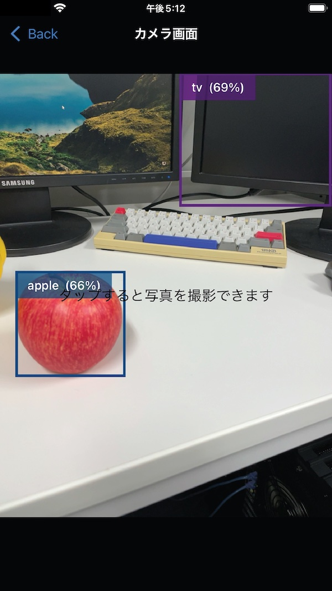
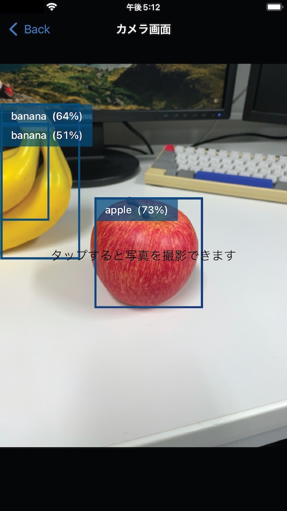

# tensorflow-camera

視覚障害者のためのカメラアプリ。音声でカメラの向きを指示してくれる。


## 使い方

Mac に Xcode の最新版がインストールされていることを前提とする。

リポジトリをクローンする。
```ShellSession
% git clone git@github.com:opu-imp/tensorflow-camera.git
```

パッケージをインストールする。
```ShellSession
% cd tensorflow-camera
% pod install
```

うまくいくと `tf-cam.xcworkspace` というファイルが作成されるので、これを Xcode で開く。

iPhone を Mac に接続。アプリを実行するデバイスを選択して、ウィンドウ上部にある三角のボタンを押す。
実機でアプリを動かす方法の詳細は https://www.ingenious.jp/articles/howto/xcode/xcode-actual-machine-test/ などを参照。


## スクリーンショット

  
